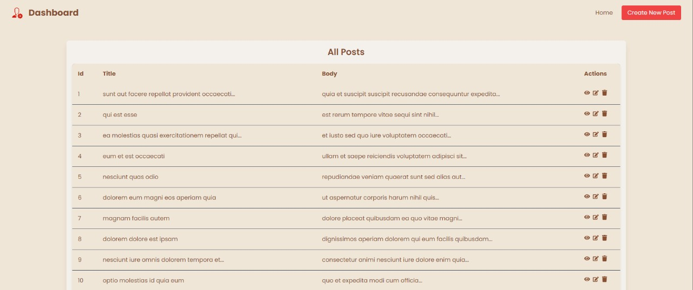
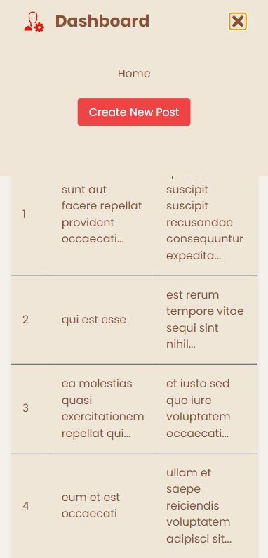

# React Intern Task

## Project Description

This project is a simple react-app where users can create, view, edit, and delete posts. It features a dashboard to display all posts, a form to create new posts, and a detailed view for each post along with feature to update post. The react-app is also responsive and works flawlessly on any device. 

## Setup Instructions

To set up this project locally, follow these steps:

1. Clone the repository:
    ```sh
    git clone 
    ```
2. Navigate to the project directory:
    ```sh
    cd 
    ```
3. Install dependencies:
    ```sh
    npm install
    ```
4. Start the development server:
    ```sh
    npm start
    ```

## UI Overview

### Homepage



### View Post


### Edit Post


### Create New Post


### Responsive Views

#### Homepage (Mobile)


#### Navbar Menu Toggle (Mobile)



#### Create Post (Mobile)


## Usage

To create a new post:
1. Click on the "Create New Post" button on the dashboard.
2. Fill in the title and body of the post.
3. Click "Create Post" to save the post.

To view a post:
1. Click on the eye icon next to the post you want to view.

To edit a post:
1. Click on the edit icon next to the post you want to edit.
2. Make the necessary changes.
3. Click "Save Changes" to update the post.

To delete a post:
1. Click on the delete icon next to the post you want to delete.

## Technologies Used

- React
- Tailwind CSS
- React Router
- React Icons

